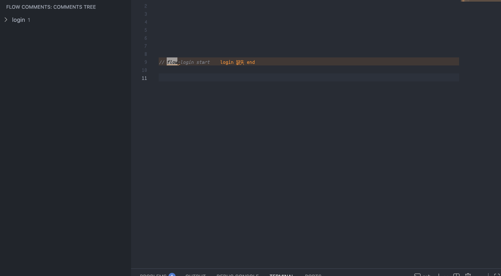

<p align="center">
  
</p>

<h1 align="center">Flow Comments</h1>

<p align="center">中文 | <a href="./README.md">English</a></p>

## 概述

Flow Comments 旨在通过简洁的注释标记，帮助开发者快速梳理和导航代码执行流程。它会在 VS Code 侧边栏生成可视化的流程树，点击树节点即可直接跳转到对应的代码位置。只需添加简单的注释标记标注代码执行步骤，就能直观呈现代码逻辑脉络。

核心优势：大幅提升代码阅读效率，减少频繁切换文件的成本，尤其适用于源码阅读、代码调试、评审协作以及团队共享业务流程的场景。

使用示范:


## 快速开始

### 安装

1. 打开 VS Code。
2. 转到扩展 (Ctrl+Shift+X)。
3. 搜索 `Flow Comments` 并安装。
4. 需要 VS Code ^1.80.0 或更高版本。

### 配置

通过 VS Code 设置 (Ctrl+,) 自定义，搜索 `Flow Comments`。完整选项列表：

| 配置项 | 类型 | 默认值 | 说明 |
| --- | --- | --- | --- |
| `flow.prefix` | string | `"flow"` | 注释前缀，例如 `// flow-login start` |
| `flow.markPrefix` | string | `"mark"` | 单行注释的标记前缀，例如 `// mark 说明` |
| `flow.includeGlobs` | array<string> | `["**/*.{ts,tsx,js,jsx}", "**/*.{java,kt}", "**/*.{go}", "**/*.{py}"]` | 参与扫描的文件匹配模式（glob），用于加速大仓库扫描 |
| `flow.ignorePaths` | array<string> | `["node_modules", "dist", ".git"]` | 索引时忽略的目录（相对工作区根） |
| `flow.maxFileSizeKB` | number | `1024` | 参与解析的最大文件大小（KB） |
| `flow.scanConcurrency` | number | `8` | 扫描并发度（一次并发处理的文件数量） |
| `flow.highlightBackground` | string | `rgba(255, 193, 7, 0.16)` | 点击跳转后行高亮的背景色（支持 rgba/hex） |
| `flow.highlightColor` | string | `#1A1A1A` | 行高亮范围内的文本颜色 |
| `flow.tokenBackground` | string | `rgba(255, 193, 7, 0.28)` | 默认状态下注释中前缀单词的背景色（仅高亮该词） |
| `flow.tokenColor` | string | `#1A1A1A` | 仅对前缀单词生效的文本颜色（提高对比度） |
| `flow.hintBackground` | string | `rgba(255, 235, 59, 0.10)` | 默认状态下 flow 注释行的背景色 |
| `flow.strictMode` | boolean | `true` | 严格模式：开启报错提示（关闭后不显示诊断） |
| `flow.commentStyles` | array<string> | `["//", "#"]` | 支持的单行注释起始符（例如 `//`、`#`、`--`） |
| `flow.markPathLevels` | number | `3` | Mark 面板路径层级数量（从末尾开始，包含文件名；最小值 1） |

## 使用指南

### 基本用法

1. 使用前缀（默认："flow"）在代码中添加注释。
2. 用 "start" 标记开始，用数字标记步骤，用 "end" 标记结束。`start` 与 `end` 支持描述文本。

示例：

```javascript
// flow-login start 用户登录流程
function login() {
  // flow-login 1 输入用户名
  const username = getUsername();

  // flow-login 2 输入密码
  const password = getPassword();

  // flow-login 3 验证
  validate(username, password);

  // flow-login end 已完成
}
```

3. 打开 VS Code 侧边栏的 Flow Comments 面板。
4. 点击节点跳转到代码行。

### 使用层级进行编排

使用点号数字表达子步骤（如 "1.1"、"1.2"、"2.1.3"）。同一流程内步骤编号需唯一，并按数字层级自动排序。

示例：

```javascript
// flow-login start
function login() {
  // flow-login 1 输入
  // flow-login 1.1 输入用户名
  // flow-login 1.2 输入密码

  // flow-login 2 验证
  // flow-login 2.1 检查格式
  // flow-login 2.2 校验凭证

  // flow-login end
}
```

### 无编号标题折叠

- 支持无需数字前缀的折叠标题。
- 解析逻辑从标题中提取关键字作为折叠标识。
- 与已有的数字编号折叠逻辑向后兼容。

示例：

```javascript
// flow-login start
// flow-login-variable Password Status
// ... 代码
// flow-login end
```

上述示例中，从 `// flow-login-variable Password Status` 提取关键字 `variable` 作为折叠标识。

### 快速标记（Marks）

- 使用 `// mark <desc>` 快速注释关键代码位置。
- 空 `// mark` 将自动生成路径-行注解。

示例：

```javascript
// mark date 处理日期函数
function processDate() {}

// mark
function compute() {
  // 自动生成路径-行注解
}
```


## 特性

- **可视化树导航**：将注释转为侧边栏树，便于概览。
- **即时跳转**：点击节点直接跳转到代码行并高亮。
- **错误检测**：警告缺失开始/结束或重复步骤。
- **代码提示**：在编辑器中高亮 flow 注释。
- **快速删除**：右键删除 flow 节点或整个流程。
- **自定义高亮颜色**：配置跳转和提示颜色。
- **可配置注释**：设置注释样式（//、# 等）和忽略路径/文件。
- **性能**：针对大型项目优化扫描控制。
- **持久索引**：保存扫描避免重新解析。
- **无编号标题折叠**：通过解析关键字实现无数字前缀的折叠。
- **增强补全**：严格过滤到已存在项的特性标题补全。
- **改进代码提示**：修复提示问题并提升提示体验。
- **快速标记**：支持 `// mark <desc>` 单行标记与空 `// mark` 自动生成路径-行注解。


## FAQ

### 前提

- 在代码中添加带前缀（默认："flow"）的注释。
- 支持 Java、JavaScript、Python、Go 等。
- 大型项目调整扫描设置。

### 常见问题

- **看不到树节点？** 检查注释添加正确，文件类型包含，路径未忽略。
- **性能慢？** 限制文件类型，增加并发，减少最大文件大小。
- **索引未更新？** 保存文件触发扫描，或使用 "Scan Active File" 命令。

## 支持

喜欢它？在 [VS Code 市场](https://marketplace.visualstudio.com/items?itemName=catislight.vscode-flow-comments&ssr=false#review-details) 或 [GitHub](https://github.com/catislight/vscode-flow-comments) 点星！

发现 bug 或有想法？在 GitHub 提交 [Issue](https://github.com/catislight/vscode-flow-comments/issues)。
